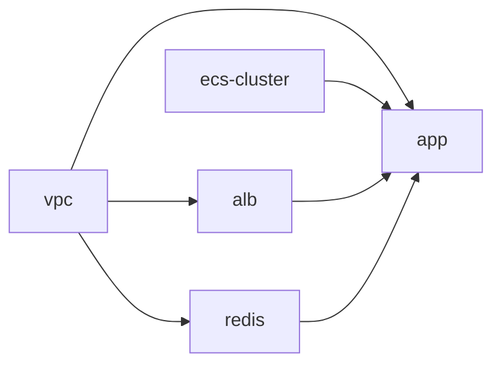
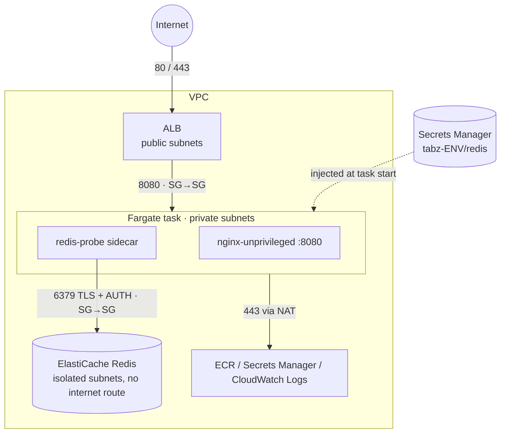

# tabz – containerized web app on ECS Fargate with Terragrunt (dev + prod)

A **plan-ready** Terragrunt layout that runs a web app (nginx) on ECS Fargate behind an ALB, reading
one secret from Secrets Manager and talking to an ElastiCache Redis replication group, in two
environments that are deliberately different (cost-optimised **dev**, highly-available **prod**).

Nothing is deployed. Two ways to try it:

| Mode | Needs | Command |
|---|---|---|
| **Mock plan** (offline) | `terraform >= 1.10`, `terragrunt >= 0.67` – **no AWS account** | `make mock-plan ENV=dev` / `ENV=prod` |
| **Real plan** | AWS creds for the account in `live/<env>/env.hcl` | `make plan ENV=dev` |

Mock mode has been run for both: dev plans **57** resources, prod **68** (Terraform 1.14.5, Terragrunt 0.67.16,
AWS provider 6.67). Real mode has not been run against an account. Terragrunt 0.67.16 was checked to render
`use_lockfile` into the generated S3 `backend.tf`; S3 bucket bootstrap itself was not exercised.

---

## What's provided

```
.
├── modules/                      # plain Terraform, no Terragrunt-isms
│   ├── ecs-service/              # ★ the reusable module (task def, service, IAM, SGs, TG, autoscaling)
│   │   └── tests/                #   `terraform test` with mock_provider – offline
│   ├── ecs-cluster/              # cluster + FARGATE / FARGATE_SPOT capacity providers
│   ├── alb/                      # shared public ALB, HTTP or HTTPS(+redirect) listener
│   └── redis/                    # ElastiCache replication group + AUTH token secret
├── live/
│   ├── root.hcl                  # remote state (S3 + native lock), provider, default tags, mock switch
│   ├── _envcommon/*.hcl          # what every env shares per component (DRY)
│   ├── dev/  env.hcl + vpc/ ecs-cluster/ alb/ redis/ app/
│   └── prod/ env.hcl + vpc/ ecs-cluster/ alb/ redis/ app/    # only the *differences* live here
├── Makefile                      # fmt / validate / test / mock-plan / plan / apply
└── .github/workflows/ci.yml      # fmt-check, validate, tests, mock plan of dev + prod on every PR
```

Dependency graph per environment (Terragrunt resolves the order with `run-all`):



The VPC uses the community `terraform-aws-modules/vpc` (pinned `6.7.3`) straight from the registry via `tfr://` –
writing yet another VPC module adds nothing.

### Runtime architecture



---

## The `ecs-service` module

One module, one service – used by `live/*/app`. A second service is just another unit directory
pointing at the same module with its own `priority` / `path_patterns`; the ALB is shared.

What it owns so callers don't have to think about it:

* **Task definition** – main container + optional `sidecars`, read-only root FS with explicit
  `writable_paths` (ephemeral volumes), `initProcessEnabled`, awslogs to its own log group.
* **Secrets** – `secrets = { ENV_NAME = { arn, key } }`. The value is resolved by the ECS agent at
  start-up (`arn:...:key::` for a JSON key), never lands in the task definition, and the execution role
  is granted `GetSecretValue` on **exactly those ARNs** (plus optional `kms:Decrypt`). Sidecars can only
  reference secrets declared at the service level (validated).
* **IAM** – separate execution role (agent) and task role (app), both with `aws:SourceAccount`
  confused-deputy protection. ECS Exec permissions only when `enable_execute_command = true`.
* **Networking** – own security group; **SG-to-SG rule pairs** for the ALB and every dependency in
  `egress_to_security_groups` (the module creates the egress on its side *and* the ingress on the
  dependency's SG). No CIDR rules to internal resources, and the dependency trusts only this service.
* **Load balancing** – own target group (`ip` type) + listener rule on a shared listener.
* **Deployments** – circuit breaker with automatic rollback, AZ rebalancing, configurable min/max %.
* **Autoscaling** – target tracking on any mix of ALB requests / CPU / memory + scheduled actions.

---

## Secret

The app reads **one** secret: `tabz-<env>/redis` in Secrets Manager, a JSON document
`{auth_token, host, port}` created by the `redis` module. Only the `auth_token` key is injected
(`REDIS_AUTH_TOKEN`) into the nginx container and the probe sidecar. Host/port are non-sensitive and are
passed as plain env vars from the redis unit's outputs.

---

## Redis connectivity – why it would work

There is no Redis client in nginx, so the task carries a **`redis-probe` sidecar**
(`redis:7.2-alpine`, non-essential, so it can never take the app down). Every 30 s it runs
`redis-cli --tls -a $REDIS_AUTH_TOKEN PING` against the primary endpoint and logs the result to
`/ecs/tabz-<env>-web`. Each layer that has to be right is set up explicitly, and each failure looks
different in the log:

| Layer | How it's satisfied | Symptom if broken |
|---|---|---|
| **Routing** | Tasks (private subnets) and Redis (elasticache subnets) are in the same VPC → `local` route. Redis subnets have their own route table with **no** internet / NAT route. | `Connection timed out` |
| **DNS** | `enable_dns_support` + `enable_dns_hostnames`; the primary endpoint resolves via the VPC resolver (Route 53 Resolver traffic isn't subject to SGs). | `Name or service not known` |
| **Security groups** | Service SG: egress `tcp/6379` → Redis SG. Redis SG: ingress `tcp/6379` ← service SG. Created as a pair by `ecs-service`; nothing else can reach Redis. | `Connection timed out` |
| **NACLs** | VPC module defaults (allow all) – SGs are the control plane. | – |
| **Encryption in transit** | `transit_encryption_enabled = true`; client uses `--tls` and the Amazon CA from the image's CA bundle. | SSL / TLS handshake error |
| **Authentication** | AUTH token from Secrets Manager; execution role may read only this secret. | `WRONGPASS` / `NOAUTH`, or task fails to start with `ResourceInitializationError` if IAM is wrong |
| **Failover (prod)** | Clients use the *primary endpoint* DNS name, which ElastiCache repoints on failover. | – |
| **Success** | | `result=PONG` |

On a real deployment you can verify it with:

```bash
aws logs tail /ecs/tabz-dev-web --follow --filter-pattern redis-probe
# dev only (ECS Exec enabled):
aws ecs execute-command --cluster tabz-dev --task <id> --container redis-probe --interactive --command sh
```

The SG pairing is also covered by the module's unit tests (`modules/ecs-service/tests`).

---

## Autoscaling – what and why

nginx (and most HTTP front-ends) is **request/CPU-bound, not memory-bound**: memory stays flat while
throughput grows, so memory-based scaling would react late or never.

* **Primary: `ALBRequestCountPerTarget`** – a *leading* signal (load arrives before CPU climbs) and
  directly tied to what the app does. Targets: prod 500 req/target/min, dev 1000.
* **Safety net: `ECSServiceAverageCPUUtilization`** – catches expensive requests the request counter
  can't see (prod 60 %, dev 75 %).
* Both are target tracking: scale **out** when *any* policy wants to (60 s cooldown), scale **in**
  only when *all* agree (300 s cooldown) → fast up, slow down, no flapping.
* `memory_target` is supported by the module for memory-bound services, just not used here.
* **Dev** additionally has **scheduled actions** that scale to 0 at 20:00 and back at 07:00
  (Mon–Fri, Europe/Zurich).

---

## dev vs prod

| | dev | prod |
|---|---|---|
| AZs | 2 | 3 |
| NAT gateways | 1 shared | 1 per AZ |
| VPC flow logs | off | on (REJECTs, 90 d) |
| Container Insights | disabled | enhanced |
| Task size | 0.25 vCPU / 512 MiB | 0.5 vCPU / 1 GiB |
| Capacity | 100 % Fargate Spot | base 3 on-demand, rest 50/50 on-demand/Spot |
| Task count | 1 – 3, **0 at night** | 3 – 12 (≥ 1 per AZ) |
| Deploy | min healthy 0 % (in-place) | min healthy 100 % / max 200 % |
| ECS Exec | on (root FS writable, required by Exec) | off (read-only root FS) |
| Logs retention | 7 d | 90 d |
| Redis | 1 × `cache.t4g.micro`, no failover | 1 primary + 2 replicas `cache.r7g.large`, Multi-AZ + auto failover |
| Redis snapshots | none | 7 days |
| Secret deletion | immediate | 30 d recovery window |
| ALB deletion protection | off | on |

---

## How to run

```bash
# 0. tools
brew install terraform terragrunt   # tested: terraform 1.14.5, terragrunt 0.67.16

# 1. offline – no AWS needed
make fmt-check validate test
make mock-plan ENV=dev
make mock-plan ENV=prod

# 2. against a real account
#    set account_id in live/<env>/env.hcl, then:
make plan ENV=dev            # first run asks to create s3://tabz-tfstate-<account>-<region>
make apply ENV=dev           # if you actually want it
```

**Mock mode** (`TG_MOCK_AWS=true`, set by `make mock-plan`): local state under `live/.mock-state`,
fake static credentials with all account/STS lookups disabled, and every `dependency` falls back to
its `mock_outputs`. The *only* behavioural difference is that prod VPC flow logs are skipped, because
the upstream VPC module calls STS for them.

**Real mode**: state goes to `s3://tabz-tfstate-<account_id>-<region>/<unit path>/terraform.tfstate`
(Terragrunt creates the bucket with versioning, encryption and public-access block; locking uses
S3-native `use_lockfile`, so no DynamoDB table). The provider has `allowed_account_ids`, so pointing
prod config at the dev account fails fast.

Newer Terragrunt (≥ 0.80) renamed `run-all plan` → `run --all plan` and `--terragrunt-working-dir`
→ `--working-dir`; the old forms still work with a deprecation warning.

---

## Trade-offs

* **Terragrunt units per component** (vpc / cluster / alb / redis / app) instead of one big stack:
  smaller blast radius and faster plans, at the cost of mock outputs and `run-all` ordering.
* **AUTH token instead of ElastiCache IAM auth / RBAC**: works with every client and with `redis-cli`
  in a sidecar. Cost: the token is generated by Terraform and therefore sits in (encrypted, versioned)
  state; rotation is a Terraform change + forced redeploy (ECS reads secrets only at task start).
* **Secret created by the redis module**: keeps the token and the cluster in lock-step. A "secret
  factory" unit would decouple them but adds a second source of truth.
* **One shared ALB per env, service owns its TG + rule**: cheap and scales to many services; the ALB's
  SG gets one egress rule per service.
* **HTTP only** – there is no domain/ACM certificate in a plan-only exercise. The ALB module already
  switches to HTTPS + 301 redirect the moment `certificate_arn` is set.
* **NAT gateways instead of VPC endpoints** for ECR / Secrets Manager / Logs: fewer resources; at prod
  traffic levels interface endpoints become cheaper and remove the internet path.
* **Docker Hub image** (`nginxinc/nginx-unprivileged`) – fine for a demo, subject to pull rate limits;
  real workloads would live in ECR with image scanning and immutable tags.
* **X86_64** – Fargate Spot doesn't support ARM64, and dev is all-Spot. Prod could move to Graviton.
* **Read-only root FS vs ECS Exec**: the module makes containers read-only by default, but ECS Exec
  needs a writable FS for the SSM agent, so enabling Exec (dev) turns read-only off automatically.
* `desired_count` is ignored after creation (autoscaling owns it), so changing it in code has no effect
  on an existing service – by design.
* Placeholder account IDs (`111111111111` / `222222222222`) – one AWS account per environment is assumed.

---

## What I'd add with more time

* **CI/CD for the app**: build → push to ECR → render new task definition revision → deploy
  (GitHub Actions with OIDC role, no long-lived keys); Terraform owns the infra, the pipeline owns the image tag.
* **Atlantis / GitHub Actions plan-on-PR, apply-on-merge** against real accounts with OIDC.
* **HTTPS end-to-end**: Route 53 zone, ACM certificate, WAF on the ALB (managed rule groups + rate limit).
* **VPC interface endpoints** (ECR api/dkr, S3 gateway, Secrets Manager, Logs) in prod.
* **ElastiCache IAM authentication** (no static token) or Secrets Manager rotation Lambda for the AUTH token.
* **Customer-managed KMS keys** for Secrets Manager, ElastiCache and logs (module inputs already exist).
* **Observability**: CloudWatch alarms (5xx, unhealthy hosts, Redis CPU/memory/evictions, Spot interruptions),
  dashboards, X-Ray/ADOT sidecar, ALB access logs bucket (input exists).
* **Policy as code**: tflint, checkov / trivy in CI, OPA/Sentinel rules (e.g. "no public IP on tasks").
* **Blue/green deployments** via ECS native blue/green or CodeDeploy, with test listener and automated rollback on alarms.
* **Predictive scaling** for prod once there is traffic history.
* **Terratest** end-to-end test in a sandbox account (apply → curl ALB → assert `PONG` in logs → destroy).
* State bucket bootstrap as its own small stack with access logging and cross-region replication.
